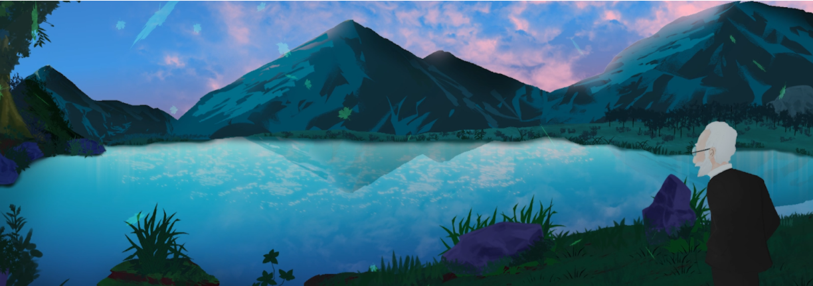
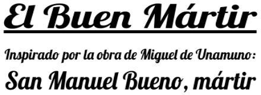
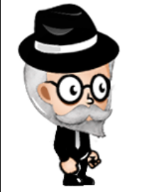
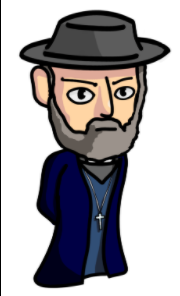
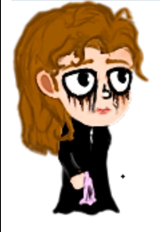
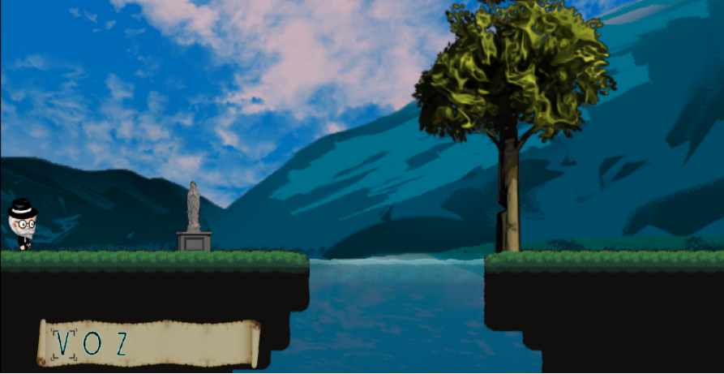
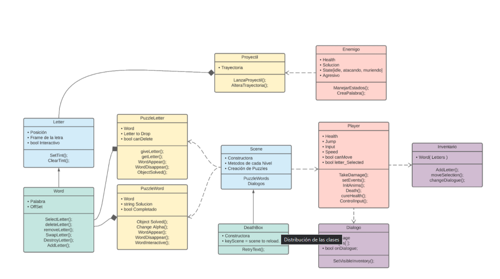
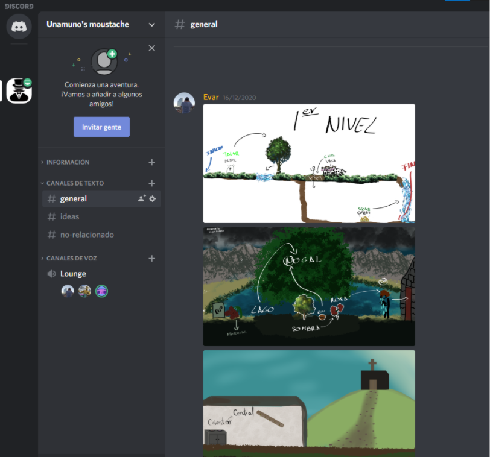

> Based on Unamuno's work, San Manuel Bueno Mártir

  
El Buen Mártir is a browser game strongly inspired by the work of Miguel de Unamuno, a story of melancholy seen from the point of view of its creator
and an original 2D design focused on puzzles. Each level is a unique, hand-crafted blend of puzzles, design, art, and architecture, all driven by its 
mechanics introduced progressively and subtly, as well as the peculiar rules of the world through its parts.

>Teaser Trailer

	<a href = "https://angelo066.github.io/SanManuelBueno/">
		

			
		

	</a>

	<a href = "https://angelo066.github.io/SanManuelBueno/">
		

			
			
			  
			
			  
		

	</a>

# Sinopsis

Nuestro protagonista no es otro que Miguel de Unamuno en el proceso de crear la obra de San Manuel Bueno Mártir, todo a través de sus conflictos   
internos que tendrá que resolver como si de puzles se tratasen. Con la ayuda de su pluma y de su libro, intentará encontrar una solución a su lucha  
ideológica gracias a la trama.

# Características principales

El juego se desarrolla en un mundo 2D de scroll lateral, donde el jugador resuelve diversos rompecabezas a la vez que se envuelve en la historia de   
la literatura consecuente. Todo lo que haga, afectará directamente a medida que avanza en la historia para así llegar a su clímax.

|Género|Plataformas|
|---|---|
|Aventura,histórico, lógica y rompecabezas|El juego se podrá jugar en los navegadores Google Chrome y Opera GX.|

#### Público Objetivo

Apto para todos los públicos que posean acceso a internet, es un juego asequible y entretenido, pero lo suficientemente desafiante como  
para que cualquiera lo disfrute. 

# Historia

* *__Primera parte__*: Se empieza con el descenso emocional de Unamuno al llegar a la conclusión de que Dios es un invento del hombre  
para no afrontar la muerte y poder vivir su vida sin preocupaciones por un fin inevitable de su existencia.

  __Diálogos__: Constan de Unamuno narrando su propia historia. El primero es nada más empezar el juego, mientras Unamuno está sentado  
en el sofá y dice:  
-“Desde hace tiempo, pienso en la vida y en su sentido"  
-"Vaga es la idea de una vida con sentido"  
-"Pues un Dios me parece una idea demasiado dulce para lo que esta vida me presenta"  
-"Muerte, guerra, enfermedad y pena no pueden ser la obra de un Dios bondadoso"  
-"Mas sin embargo la iglesia y los dirigentes no dejan de nombrarle a él y a su gracia"  
-"¿Qué he de hacer pues Dios mío?"  
-"¿Para saber de tu existencia y dejar de padecer esta agonía que me asola a todas horas?"  
-"Esto me recuerda a aquella vez que visité aquel pueblecito... ”

* *__Segunda parte__*: Unamuno empieza a recordar su visita a aquel pequeño pueblo que es donde empieza nuestro juego y donde se desarrollará  
al completo, con 3 nivel representando el camino hasta el pueblo(Primer nivel), llegada al pueblo(Segundo) y conversación con Don Manuel (Final)  

  __Diálogos__:  
  - *__Nivel 1__*: Nada más aparecer:  
  -*“Recuerdo aquel campo camino a la iglesia", "Con ese resplandeciente lago al fondo y el sonido de los animales en la lejanía"*  
  -*"Aquel altar a la virgen María, siempre me produjo alivio”*  
  -Resolviendo el segundo puzzle: *“Ah sí, recuerdo aquellas vacas que hacían contraste con el cielo prístino”*.

  - *__Nivel 2__* : Nada más aparecer Unamuno:  
  -*“Aquella iglesia, en aquel templo a la fe ciega conocí a Manuel"*  
  -*"Santo por su devoción y sacrificio a su rebaño”*  
  -Señora Guadalupe, personaje secundario diálogo 1 : *“¡Ay de mí, Mi marido falleció hace 3 días!  
  ¡Y no tengo ni una triste flor que dejarle en su lecho”*.  
  -Señora Guadalupe diálogo 2, después de resolver el puzzle de la rosa: *“Muchas Gracias buen señor, ahora Pedro descansa en paz  
  Pase a mi casa a refugiarse de la lluvia y a calentarse junto al fuego”*.  

  - *__Nivel 3__*: **Batalla Final**:  
  -Don Manuel: *“Buenas, hijo mío,¿Qué te trae por nuestra iglesia?"*.  
  -Unamuno : *"He oído Padre, que es usted especial"*.  
  -Don Manuel: *“Pues has debido oír mal hijo mío. Pues no soy más que un hombre de Dios”*  
  -Unamuno: *“He oído que ha perdido usted la fe Padre"*.  
  -Don Manuel: *“¡No digas sandeces... Yo no... Yo nunca…!”*  
  **Fase Dos del Combate**:  
  -Don Manuel: *“¡Aléjate de mi templo y de mi rebaño!”*  
  -Don Manuel : *“Así es hijo mío. No creo más en Dios ¿Has hablado con Lázaro? Es un hombre de ciencia del pueblo.  
  Me ha hablado tanto de ciencia. Tantas cosas que explicábamos mediante Dios, ahora ya no son Dios .  
  Y me hace pensar, ¿Por qué iba a ser nada Dios? , ¿No será simplemente la dulce las mentiras?  
  Contada desde el albor de los tiempos, para que no le tengamos miedo a la vida.
  Hijo mío, no puedo dejar que mis feligreses se enteren. No quiero que pasen por la misma agonía que yo.  
  La agonía de saber que nada importa.  
  Que todos estamos condenados a lo mismo. Pues mi sentido común me dice que después de esto solo hay oscuridad y polvo.  
  Ya no entiendo nada hijo mío. Ahora por favor déjame solo, con mi angustia. Mi angustia y mi deber de cuidar de mi pueblo."*  
  *__Final__*: Volvemos a ver a Unamuno igual que al principio, pero concluyendo su historia.  
  -*“Y así me llevé conmigo parte de su agonía.  
  Lo suficiente como para que me atormente personalmente.  
  Y creo que me atormentará para siempre. O bueno, hasta que muera. Entonces, tampoco sufriré mucho”*.  

# Personajes

|*Personaje*|*Descripción*|*Características*|
|---|---|---|
|Unamuno|Encarnado como el personaje principal.|Capaz de guardar letras en el cuaderno para usarlas más tarde en sus desafíos mentales.|
|San Manuel Bueno|El cura del pueblo que pierde la fe pero finge mantenerla para que sus feligreses no sufran al igual que él.|Inflige daño con su voz.|
|Señora Guadalupe|Señora que llora a su marido al lado de una tumba|Da una pista del puzzle  en su diálogo. Permite la entrada a su morada para continuar con el nivel y acceder al siguiente puzzle.|  

# Jugabilidad

El objetivo del juego es acabar la obra San Manuel Bueno Mártir completando los rompecabezas que se presentan.  
Cada uno representará una parte del libro y se resolverá con mecánicas que giran entorno a la narrativa y los juegos de palabras como anagramas.

### Experiencia del jugador

A lo largo de la trama, Unamuno encontrará obstáculos que le entorpecen a la hora de completar su obra y tendrá que afrontar la falta de fe,  
la desesperanza y el conflicto que le lleva a ser deshonesto consigo mismo, representados por personajes del libro a los que tendrá que desafiar.  
Para sobreponerse a estas adversidades, Unamuno tendrá que enfrentarse a los obstáculos con la ayuda de su ingenio, que lo llevará  
hacia el camino hacia la autorrealización.

### Mecánicas

Es un juego 2D de scroll lateral, en el que el jugador se mueve libremente tanto en el eje vertical como horizontal utilizando el teclado y haciendo  
uso de su inventario y la pluma con el ratón para resolver los diferentes puzzles y contados enemigos que hay a lo largo del juego.  
El objetivo es simple, completar la historia avanzando por los niveles que irán incrementando la dificultad y derrotando a los enemigos que se  
encuentre sin morir.
- **Atributos de personajes**

|*Personaje*|*Acciones Disponibles*|
|---|---|
|Miguel de Unamuno|-Movimiento en 2 dimensiones. -Atacar. -Interacción con el libro(inventario) y los puzzles ordenando sus letras.  Podrá tachar letras de los puzzles, añadir letras o recuperar las añadidas.|
|San Manuel Bueno|-Atacar con su voz infligiendo daño a Unamuno desde la distancia.|
|Señora Guadalupe|-Te da una pequeña pista a través de sus diálogos|

### Objetivos y Recompensas

*__Objetivo__*: Terminar el libro completando los diferentes puzzles que encontramos a lo largo del juego.

|*__Recompensas__*|*__Castigos__*|*__Dificultad de niveles__*|
|---|---|---|
|El avance en la trama y la satisfacción de completar puzles por sí mismos. El deleite de una historia nunca contada.|La ralentización del avance del juego. Cada vez que muera, se reiniciará el nivel.|Avanzará la complejidad de los puzzles  a medida que el jugador vaya superando cada prueba.|

### Diseño de Nivel 

El diseño de cada nivel es realizado con el objetivo de seguir una historia que conduzca directamente al combate del personaje con el enemigo:  
- *__Nivel 1__*:  El nivel inicial  consta de tres puzzles distribuidos de manera que la dificultad aumenta progresivamente. El desafío inicial se trata de “Altar” y un río que bloquea el camino de Unamuno. Ordenando las letras de “Altar” se puede conseguir “Talar”, lo que provoca que un árbol a la orilla del río sea talado y caiga sobre éste, despejando así el camino de obstáculos. No obstante, vuelve a aparecer un nuevo problema relacionado con un ganado de vacas que bloquean el camino. Usando el ingenio, y eliminando la letra ‘s’, se consigue formar “cava”. Unamuno consigue cavar un agujero en el suelo que lo lleva a una cueva, la cual conlleva al siguiente enigma.
Lo que parece ser un pequeño santuario con velas, es un puzzle que forma la palabra “Ceras”. Más adelante se puede ver una cascada subterránea que bloquea el paso del protagonista. Barajando las letras de “Ceras”, se consigue el verbo “Secar”, lo que provoca la disminución del caudal de la cascada y por consiguiente su desaparición, dejando el camino libre y abriendo paso al fin del nivel. 

- *__Nivel 2__*: Consta de 3 puzzles. El primero de ellos consiste en obtener una letra necesaria para solucionar el Puzzle principal: Lago. De la palabra “Nuez” hay que conseguir la “N” para así añadirla a “Lago”. Combinando las letras se obtiene “Nogal”. Seguidamente crece un Nogal que proyecta una “Sombra”. De dicha palabra se debe conseguir “Rosa”, con  lo cual la Sra Guadalupe permitirá al jugador la entrada a su morada, desde donde se puede apreciar una iglesia a lo lejos. Dentro de su morada se encuentra el siguiente puzzle: “Calentar”. En la casa se encuentra un marco con tres llaves. El objetivo es que, eliminando una de las “a” en el puzzle, se consiga “Central”, obteniendo así la llave central, cuyo objetivo es permitir la entrada a la iglesia, y así finalizar el nivel. 

- *__Boss__*: Unamuno llega a una iglesia, donde le espera el cura San Manuel Bueno. Unamuno habla con él, contándole que ha oído por parte de los pueblerinos, que ha perdido la fe. San Manuel se enfurece ante tal acusación y comienza un combate. El enemigo lanzará letras procedentes de su voz que provocarán daño al jugador al contactar con él. La manera de solucionar ésta aflicción será dejar que lance letras, es decir, quitarle su “Voz”. Algunas de las letras que son lanzadas se pueden obtener y formar un puzzle. Si se consiguen las letras ‘v’, ‘o’ y ‘z’, y se ordenan, provocarán daño a San Manuel. Provocando así a una segunda fase, aumentando la dificultad de la batalla. Ahora el objetivo es derrumbar a San Manuel, es decir, derruir su “fe”. Usando la misma dinámica explicada anteriormente, se forma la palabra “Fe”, que finalizará con el enemigo y dará fin al nivel.  

# Estética e Interfaz de Usuario

### Estética

Temática caricaturesca en 2D. Con un tono melancólico que transmite al jugador las emociones de Unamuno escribiendo esta historia.  
El daño ocasionado al jugador se podrá apreciar mediante la disminución de saturación del color en general. En pocas palabras, cada vez que el jugador  
reciba daño, todo el color se vuelve un poco más gris. Cuando haya muerto, todo será gris.  
> Imagen de la intro

### Interfaz

La interfaz se compone únicamente por:  
- El movimiento de la cámara, que sigue constantemente al jugador  
- El inventario del jugador, que se situará en la esquina inferior izquierda de la pantalla.  

Así, la sencilla interfaz permite al jugador centrarse en la resolución de los puzzles, sin ningún tipo de distracción.
> Imagen de ejemplo de la interfaz

### Categoría

Fuertemente inspirado por los juegos Baba is you y Typoman Mobile, ambos centrados en la resolución de puzzles utilizando las palabras y su significado  
en los niveles como mecánica principal.  

### Esquema de controles

Los controles se basan en el uso del teclado y del ratón.
|Boton/Input|Acción|
|---|---|
||Movimiento a la izquierda y derecha respectivamente.|
||Salto.|
||Moverse de izquierda a derecha en su inventario|
||Añadir, si está en un puzzle, una letra de su inventario seleccionada al puzzle|
||Atacar con la pluma. Esta acción permite destruir letras de algunos puzzles o proyectiles de enemigos.|
||Recuperar una letra añadida a un puzzle, si ésta está seleccionada|
||Selección, reordenar e interacción con los puzzles. |
||Activar el modo “tachar”. Si selecciona cualquier letra de un inventario, ésta queda tachada y queda “eliminada” del significado de la palabra.|

### Licencia

Historia basada en la obra del propio protagonista y autor, Miguel de Unamuno, San Manuel Bueno Mártir.

# Estructura de Clases

- Puzzle. que se encargue de comprobar cuando un puzzle está completo, comprobando la palabra que se busca con la que se recibe del input del jugador. Puede ser un puzzle normal o un puzzle que al ser solucionado, suelte una letra para ser recogida.
- Palabra. es una clase que complementa a Puzzle que se encarga de reordenar el orden de las letras, tachar letras, añadir letras y eliminar letras.
- Letra. Se encarga de componer una palabra, teniendo la opción de ser interactiva o no.
- Diálogo. Se encarga de mostrar en pantalla varios textos consecutivamente. Detiene el input del jugador hasta que finalizan los mensajes a mostrar.
- Inventario. Se encarga de almacenar las letras que el jugador va recogiendo a lo largo del nivel. Le permite seleccionar una letra específica y añadirla a un puzzle determinado. Al igual que recobrar dicha letra. 
- Player. Que se encargue del control, de la vida a la hora de las peleas de los bosses. Contiene una lista de letras que almacena las letras  que colecciona el jugado  
- Enemigo. Controla de forma autónoma al enemigo que interacciona con el jugador haciéndole un daño específico. Es capaz de disparar proyectiles ( letras ) que infligen daño.
- Proyectiles. Se componen de letras o palabras. Tiene la particularidad de hacer daño, moverse a una cierta velocidad y trayectoria, y hacer daño a un objetivo específico que colisione con él.  
- Clase Nivel. Se encarga de establecer el entorno de un nivel, sus puzles, enemigos, crear y posicionar al player. Además carga todos los recursos necesarios para las clases incluidas en el nivel.

### Diagrama UML

>Distribucion de clases

  

# Gestión

Unamuno’s Moustache se ha organizado usando las herramientas Git Kraken, para el control y colaboración del equipo en repositorios en la nube.  
Y Pivotal Tracker para la administración de tareas e historias de usuario durante las iteraciones del proyecto.

# Comunicación

La comunicación de los miembros del equipo ha sido principalmente mediante Discord, en un canal creado exclusivamente para el desarrollo de El Buen Mártir.  
Al igual, este medio también fue útil para la compartición rápida de recursos.  
>Imagen de nuestro servidor de Discord

# Música

- Chiptunes con BoscaCeoil y holy music sin copyright.
- Holy Spirit Piano :  
  [Track 1](https://www.youtube.com/watch?v=Q4kynE8W21I)  
  [Track 2](https://www.youtube.com/watch?v=SW10hGxbz9Y)
  

> Members
- Ángel López Benítez([angelo066](https://github.com/angelo066))
- Juan Diego Mendoza Reyes ([Juandiem](https://github.com/Juandiem))
- Iván Prado Echegaray ([IvanPradoEchegaray](https://github.com/IvanPradoEchegaray))
- José Daniel Rave Robayo ([JosedaMachine](https://github.com/JosedaMachine))

> Check out our planning proyect here  
[El buen Martir Pivotal Tracker (permission required)](https://www.pivotaltracker.com/n/projects/2468478)

, Copyrigth(c) 2021 Unamuno's Moustache

