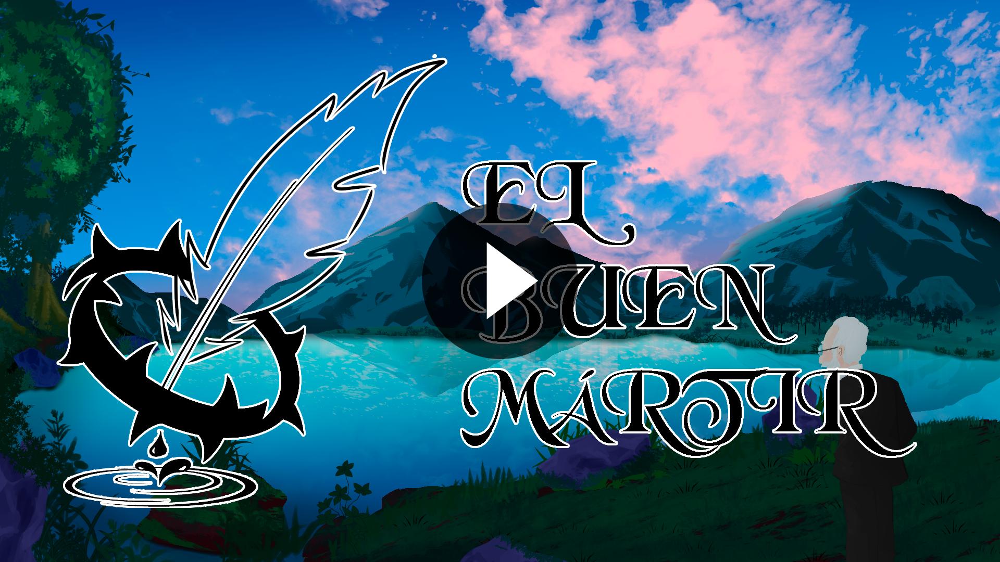

> Basado en la obra de Unamuno, San Manuel Bueno Mártir

El Buen Mártir es un juego para navegador inspirado en la obra de Miguel de Unamuno, una historia de melancolia vista desde el punto de vista de su creador
y un original diseño 2D centrado en puzzles. Cada nivel es una mezcla única y artesanal de puzzles, diseño, arte y arquitectura, todo ello impulsado por 
unas mecánicas propias introducidas de forma progresiva y sutil, además de las peculiares reglas del mundo a través de sus partes.

>Teaser Trailer

> Miembros
- Ángel López Benítez([angelo066](https://github.com/angelo066))
- Juan Diego Mendoza Reyes ([Juandiem](https://github.com/Juandiem))
- Iván Prado Echegaray ([IvanPradoEchegaray](https://github.com/IvanPradoEchegaray))
- José Daniel Rave Robayo ([JosedaMachine](https://github.com/JosedaMachine))

, Copyrigth(c) 2019 Carlos León

