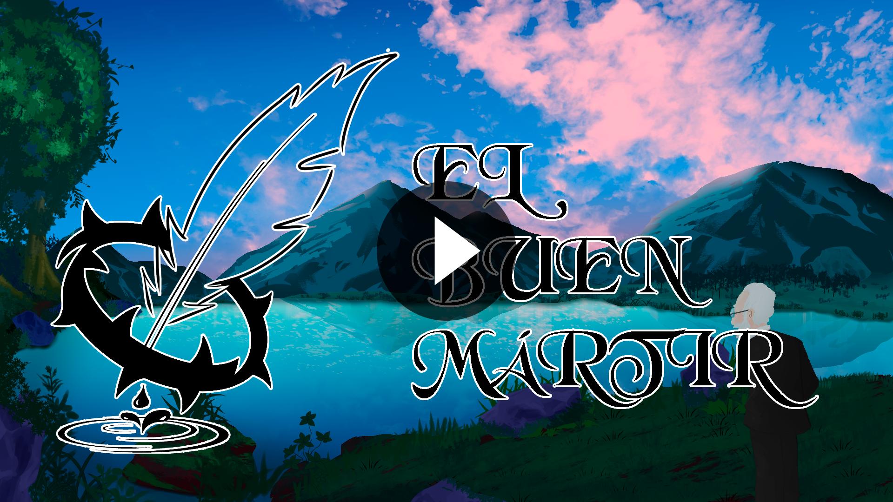

> Based on Unamuno's work, San Manuel Bueno Mártir

El Buen Mártir is a browser game strongly inspired by the work of Miguel de Unamuno, a story of melancholy seen from the point of view of its creator
and an original 2D design focused on puzzles. Each level is a unique, hand-crafted blend of puzzles, design, art, and architecture, all driven by its 
mechanics introduced progressively and subtly, as well as the peculiar rules of the world through its parts.

>Teaser Trailer

	<a href = "https://angelo066.github.io/SanManuelBueno/">
		

			
		

	</a>

[Game Design Document(WIP)](https://drive.google.com/file/d/1s9nX9cytcLNmPD6Ch-pfDBtSYY2wt9WI/view?usp=sharing)

> Members
- Ángel López Benítez([angelo066](https://github.com/angelo066))
- Juan Diego Mendoza Reyes ([Juandiem](https://github.com/Juandiem))
- Iván Prado Echegaray ([IvanPradoEchegaray](https://github.com/IvanPradoEchegaray))
- José Daniel Rave Robayo ([JosedaMachine](https://github.com/JosedaMachine))

, Copyrigth(c) 2019 Carlos León

